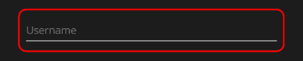
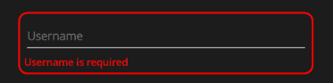
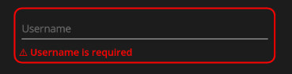

This article is a follow-on from my last post, which discussed accessibility in .NET MAUI apps more generally. Here, we’re diving deeper into error messages, showing how to make them clear, actionable, and mobile-friendly, while also using some neat MAUI features to ensure they’re announced correctly by assistive technologies.

Error messages are like that friend who whispers, “you’ve got something in your teeth” you need them, but only if they do it clearly, politely, and at the right time. On mobile, poorly designed errors can frustrate users faster than a laggy tap on a button.

Let’s make sure your MAUI app doesn’t commit that crime.

<div class="alert alert-primary" role="alert">
  For context: This blog is me documenting the cool things I have learnt over time and some things I’ve recently discovered about mobile app development, hoping it helps someone out there make their apps better. Some of it is accessibility focused, some of it is just good mobile app practices either way, if it saves a user from frustration, my day is made.
</div>


------------------------------------------------------------------------

## Why Accessible Errors Matter on Mobile

On a mobile screen, mistakes are inevitable. Users:

- Mistap fields because thumbs aren’t precision tools
- Use autofill incorrectly
- Lose context when scrolling through a long form

For users with screen readers, vision impairments, or motor challenges, inaccessible errors can turn your sleek app into an obstacle course. Imagine a user filling a signup form only to find an error at the bottom after scrolling through multiple fields they might never figure out what went wrong.

Accessible error messages don’t just prevent frustration they guide users efficiently and make your app feel polished. Good error handling:

- Links messages to the exact field causing the issue
- Announces errors immediately for assistive tech
- Provides actionable instructions on how to fix the problem

Even small improvements here, like ensuring an error is announced as soon as it appears or using icons and text together can make a huge difference in mobile app usability.

On small screens, clarity is king: users don’t have room to hunt for clues or second-guess what went wrong.

💡 Think of error messages as your app holding the user’s hand for a moment, instead of leaving them to stumble in the dark.

------------------------------------------------------------------------

## Best Practices for Mobile MAUI Apps

### Speak Human

Error messages should be written like a helpful teammate, not a cryptic system log. Mobile users in particular don’t want to be stuck wondering what went wrong they need to know:

- What’s broken? (clearly name the problem)
- Where do I go from here? (point them to the fix)
- How do I move forward? (give the exact next action)

Two Examples of this:
#### Email Address Failure

<div class="alert alert-danger" role="alert">
❌ Invalid input.
</div>

<div class="alert alert-success" role="alert">
✅ Enter a valid email, like name@example.com.
</div>

#### Password Failure

<div class="alert alert-danger" role="alert">
❌ Login failed.
</div>

<div class="alert alert-success" role="alert">
✅ Your password is too short. It must be at least 8 characters.
</div>

Just as important, the tone should avoid blame. A good message doesn’t make the user feel at fault for not knowing what to do, instead it gives them the confidence to keep going. So by making errors conversational and solution-oriented, you keep users in flow instead of leaving them frustrated at a dead end.

### Tie Errors to the Relevant Field

Errors should appear next to the field that caused them, so users don’t have to scroll or guess. In MAUI, you can combine visibility binding with accessibility properties:


``` xml
<Entry 
       x:Name="EmailEntry" 
       Placeholder="Email" />
<Label 
       Text="Enter a valid email."
       TextColor="Red"
       SemanticProperties.Description="Error message for invalid email"
       IsVisible="{Binding IsEmailInvalid}" />
```


This setup ensures:

- The error is visible right where it matters
- The screen reader announces the problem immediately
- Users know exactly what to fix

### Use Multiple Cues

Color alone isn’t enough. Combine text, icons, and color to communicate errors effectively. Here’s the progression:

<div class="alert alert-danger" role="alert">
       <a href="#" class="alert-link">Bad Example:</a> Only color change<br>
       <a href="#" class="alert-link">Problem:</a> Users who are color-blind or have low vision might not notice the error.
</div>



``` xml
<Entry Placeholder="Username" />
<!-- Turns border red on error -->
```


<div class="alert alert-warning" role="alert">
       <a href="#" class="alert-link">Good Example:</a> Text + color<br>
       <a href="#" class="alert-link">Problem:</a>The message is visible as text, but a screen reader may not announce it unless additional accessibility properties are used.<br>
</div>
 

``` xml 
<Entry Placeholder="Username" />
<Label Text="Username is required" TextColor="Red" />
```

<div class="alert alert-success" role="alert">
       <a href="#" class="alert-link">Best Example:</a>Text + icon + color + accessibility properties, <br>
       <ul>
              <li>Text: clearly explains the error</li>
              <li>Icon: reinforces importance visually</li>
              <li>Color: grabs attention</li>
              <li>Accessibility properties: ensures the error is announced immediately by screen readers</li>
       </ul>
</div>
 
``` xml
<Entry x:Name="UsernameEntry" Placeholder="Username" />

<Label Text="⚠ Username is required"
       TextColor="Red"
       SemanticProperties.Description="Error message for missing username"
       IsVisible="{Binding IsUsernameInvalid}" />
```

------------------------------------------------------------------------
### Immediate Feedback

Users shouldn’t have to wait until pressing “Submit” to discover something’s wrong. Showing errors as users type or when they leave a field is critical on mobile, where scrolling back and forth is cumbersome.

For accessibility, dynamic error messages won’t automatically be read by screen readers. To ensure all users receive immediate feedback, use SemanticScreenReader.Announce in your code-behind whenever an error appears:
```xml
if (IsPasswordTooShort)
{
    SemanticScreenReader.Announce("Password must be at least 8 characters");
}
```

This ensures blind and low-vision users get the same instant guidance as sighted users.
<div class="alert alert-success" role="alert">
       <a href="#" class="alert-link">💡 Pro tip:</a>Test on both iOS and Android, as the timing and queuing of announcements can differ between platforms.
</div>

### Keyboard & Focus Management

Error handling isn’t just about visibility or announcements, it’s also about smooth navigation for users with external keyboards, switches, or other accessibility tools.

Best practices include:

Move focus to the first error after submission.
When a user submits a form with errors, set focus to the first invalid field and announce it:

```xml
if (IsEmailInvalid)
{
    EmailEntry.Focus();
    SemanticScreenReader.Announce("Please enter a valid email address");
}
```

#### Respect user control.
Only move focus after form submission. Avoid shifting focus while users are typing, as it can be disorienting.

With this approach, both touch and non-touch users get a clear, accessible path through your form, reducing frustration and guiding them efficiently.

------------------------------------------------------------------------

## References & Further Reading

-   [Microsoft: Accessible Forms in .NET MAUI](https://learn.microsoft.com/en-us/dotnet/maui/fundamentals/accessibility)
-   [WCAG 2.1: Error Identification](https://www.w3.org/WAI/WCAG22/quickref/?versions=2.1#error-identification)
-   [WebAIM: Accessible Error Messages](https://webaim.org/techniques/forms/#error-messages)

------------------------------------------------------------------------

## Final Thoughts

On mobile, every tap counts, and every message matters. Accessible error messages in MAUI aren’t just a checkbox they’re a power move. They reduce frustration, guide users effortlessly, and make your app feel smart, considerate, and professional.

MAUI provides SemanticProperties and AutomationProperties specifically for mobile accessibility:

<ul>
       <li>SemanticProperties.Description → provides context</li>
       <li>SemanticProperties.Hint → tells users how to fix it</li>
       <li>SemanticProperties.Announce → immediately read aloud when an error appears</li>
</ul>

Combine these with dynamic visibility, and your mobile forms become usable for everyone.
