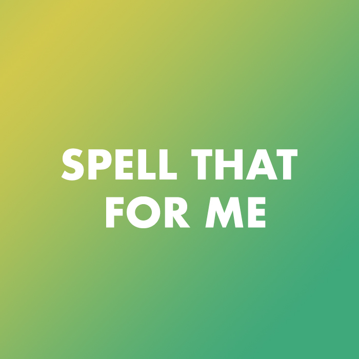
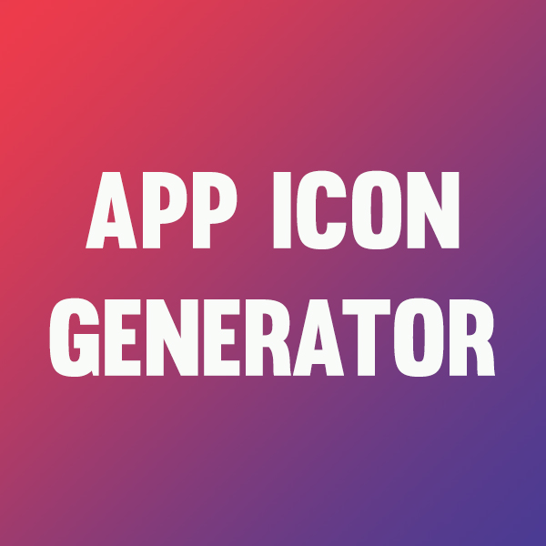
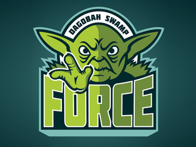

    
<h2 class="heading">Socials</h2>

    

    	

		    <a href="{{site.github}}" target="_blank"><i class="fa fa-github" aria-hidden="true"></i></a>
		    <a href="{{site.linkedIn}}" target="_blank"><i class="fa fa-linkedin" aria-hidden="true"></i></a>
		    <a href="{{site.apple}}" target="_blank"><i class="fa fa-apple" aria-hidden="true"></i></a>
		    <a href="{{site.twitter}}" target="_blank"><i class="fa fa-twitter" aria-hidden="true"></i></a>
		

	

    <h2 class="heading">Skills</h2>
    <ul>
    	<li>Swift</li>
        <li>Mac Development</li>
        <li>iOS Development</li>
        <li>C#</li>
        <li>Xamarin</li>
    </ul>

<!-- 

    
<h2 class="heading">iOS Apps</h2>

    

        

    	  
		  

		  	

		  		
		  	

		  	

		  		<h2>{{post.title}}</h2>
		  		
{{post.content}}

		  		<a href="{{post.link}}" {{post.downloadable}}>View Project</a>
		  	

		  

		  
        

    

 -->

    
<h2 class="heading">iOS Apps</h2>

    

        
   
            

                <a class="zoom green" href="morsed.html">
                
Morsed - V2.1.0
</a>
            

            

                <a class="zoom green" href="todaily.html">
                
Todaily - V2.6.0
</a>
            

            

                <a class="zoom green" href="spellthatforme.html">
                
Spell That For Me - V1.0.2
</a>
            

        

    

    
<h2 class="heading">Mac Apps</h2>

    

        
   
            

                <a class="zoom green" href="https://robertwildgoose.github.io/assets/AppIconGenerator.zip">
                
App Icon Generator V1.0
</a>
            

            

                <a class="zoom green">
                

</a>
            

            

                <a class="zoom green">
                

</a>
            

        

    

<!-- 

    
<h2 class="heading">Libraries</h2>

    

        
   
            

                <a class="zoom green" href="morsed.html">
                
Morsed - V2.1.0
</a>
            

            

                <a class="zoom green" href="work01.html">
                
Todaily - V2.6.0
</a>
            

            

                <a class="zoom green" href="work01.html">
                
Spell That For Me - V1.0.2
</a>
            

        

        
   
            

                <a class="zoom green" href="work01.html">
                
App Icon Generator V1.0
</a>
            

        

    

 -->

    <h2 class="heading">Education</h2>
    
		

			

			
{{post.title}} {{post.completedate}}

    	

    

