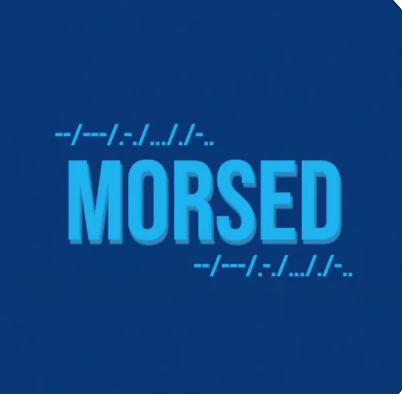
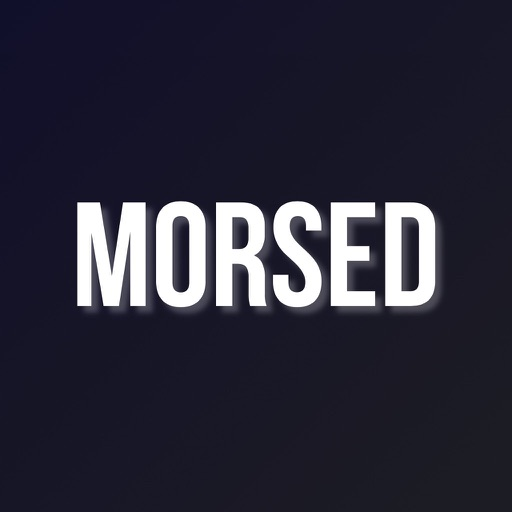

<link
  rel="stylesheet"
  href="https://rawgit.com/kremalicious/appstorebadges/master/dist/appstorebadges.min.css"
/>

<h4>A free morse code translation application, allowing the user to translate from free text to morse code and morse code to free text as well.The ability to share translation on other applications.</h4>

   

    <a class="badge" href="https://apps.apple.com/gb/app/morsed/id1469132515?l=nb">
      <svg class="badge__icon">[…]</svg>
      Download on the
      App Store
    </a>

   
    

    

    

    <h2 class="heading">Release Notes</h2>
        

		    

		  	  

		  		  
		  	  

		  	  

		  		  <h3>Version 2.1.1 - 3 Jun 2021</h3>
		  		  <ol>
              <li>Small Fixes Relating To App Start Up</li>
              <li>Small Fixes Relating To Translations</li>
            </ol>
		  	   

		    

        

          

            
          

          

            <h3>Version 2.1.0 - 1 Jun 2021</h3>
            <ol>
              <li>Logo Changes</li>
              <li>UI Changes</li>
              <li>Start Up Screen</li>
              <li>Ability To Translate To Audio</li>
            </ol>
           

        

        

          

            
          

          

            <h3>Version 2.0.1 - 14 Apr 2021</h3>
            <ol>
              <li>Fixed issue with certain characters and numbers not translating.</li>
              <li>Added Dutch to the selectable languages.</li>
              <li>Small UI Changes.</li>
            </ol>
           

        

        

          

            
          

          

            <h3>Version 1.10.1 - 17 Nov 2020</h3>
            <h5>In this version I have added support for the following languages</h5>
            <ol>
              <li>English</li>
              <li>Thai</li>
              <li>Mandarin Chinese</li>
              <li>Hindi</li>
              <li>Spanish</li>
              <li>French</li>
            </ol>
           

        

        

          

            
          

          

            <h3>Version 1.9.3 - 29 Jun 2020</h3>
            <h5>This release contains bug fixes as well as push notification integration.</h5>
           

        

        

          

            
          

          

            <h3>Version 1.9.2 - 31 May 2020</h3>
            <ol>
              <li>A New Tabbed Layout</li>
              <li>Bug Fixes.</li>
              <li>Colour Change.</li>
            </ol>
           

        

        

          

            
          

          

            <h3>Version 1.8.1 - 30 March 2020</h3>
            <h4>This version includes "Audio Morsed" allowing users to type a message and have the translated morse code played back to them, this feature had been requested in reviews multiple times and is only the first addition with Audio Morsed.</h4>
           

        

        

          

            
          

          

            <h3>Version 1.7.2 - 24 March 2020</h3>
            <h4>In this version I've added a feature submission page to allow people to post things they would like to see integrated into the application, as well as this i've fixed a few bugs.</h4>
           

        

        

          

            
          

          

            <h3>Version 1.7.2 - 28 Feb 2020</h3>
            <h4>I've cleaned up some bugs as well as adding support for emojis. 
            You can now replace those dots and dashes with emojis to add that extra layer of amusement to your Morsed conversations..</h4>
           

        

        

          

            
          

          

            <h3>Version 1.6.1 - 16 Feb 2020</h3>
            <ol>
              <li>I've cleared up the UI so that it follows suit throughout the app</li>
              <li>Removed the Dark Mode switch originally added and integrated Native Dark Mode</li>
              <li>Fixed a few issues within the iMessage Extensions not auto translating on selection.</li>
            </ol>
           

        

        

          

            
          

          

            <h3>Version 1.5.2 - 8 Feb 2020</h3>
            <h5>Fixed a few issues with translation sometimes missing letters. Implemented new iMessage functionality, this allows users to send Morsed messages directly from the messages application.</h5>
           

        

        

          

            
          

          

            <h3>Version 1.4.1 - 4 Jan 2020</h3>
            <h5>In this version I've added a new "Morse Code Guide" allowing users to see all characters side by side translations.</h5>
           

        

        

          

            
          

          

            <h3>Version 1.3.1 - 6 Dec 2019</h3>
            <h5>In this version, numerical translations have been added as well as some minor bug fixes.</h5>
           

        

        

          

            
          

          

            <h3>Version 1.3.1 - 7 Nov 2019</h3>
            <h5>This version contains a total redesign of the app, including dark mode. The ability to share translations over other apps is now live allowing you to use your messages in WhatsApp, Facebook Messenger and more. The biggest improvement within this release is the size of the application from the previous 66mb</h5>
           

        

        

          

            
          

          

            <h3>Version 1.0.1 - 21 June 2019</h3>
            <h5>Initial App Release</h5>
           

        

        

    

